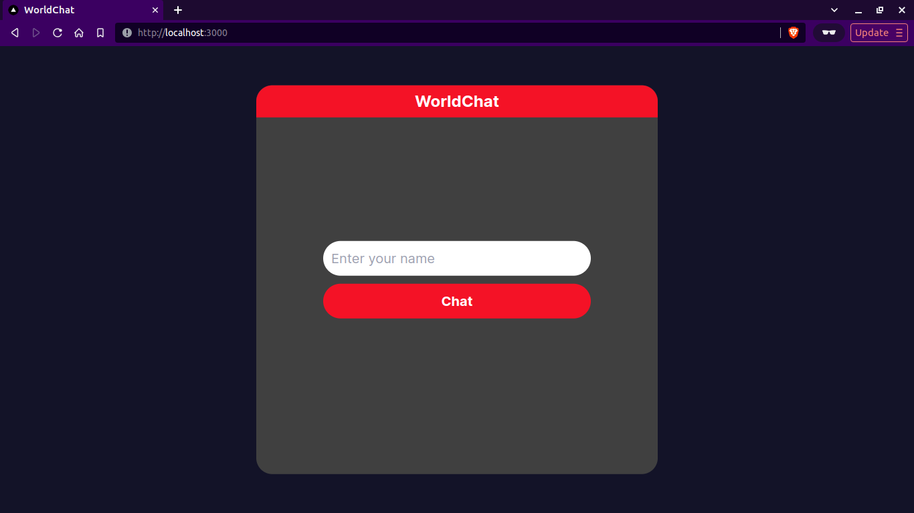
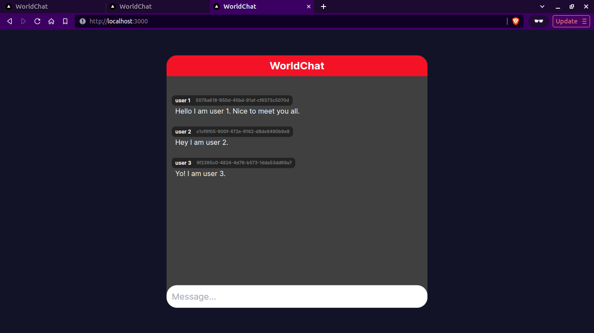

# WorldChat

WorldChat: Where the World Connects in One Global Conversation.
## Overview

WorldChat enables users to join global conversations. FastAPI powers the backend server for real-time communication, while Next.js handles the dynamic and interactive frontend.

## ScreenShots





## Technologies Used

- FastAPI
- Next.js
- Tailwindcss

## Setup Instructions

Follow these steps to set up the WorldChat project:

### Backend Setup

#### Clone the repository

```bash
git clone https://github.com/dheerajroy/WorldChat.git
```

#### Navigate to the server directory

```bash
cd WorldChat/server
```

#### Install the required Python dependencies

```bash
pip install -r requirements.txt
```

#### Run the FastAPI server

```bash
python3 app/main.py
```

**If the server is hosted elsewhere, modify the CORS settings in app/main.py to allow the appropriate origins.**

### Frontend Setup

#### Navigate to the client directory

```bash
cd WorldChat/client
```

#### Install the Node.js dependencies

```bash
npm install
```

#### Run the Next.js development server

```bash
npm run dev
```

## Usage

Access the WorldChat application by navigating to http://localhost:3000 in your browser.

## Configuration

If the server and client are hosted separately, modify CORS settings in server/app/main.py and update API_URL in client/app/page.jsx.
